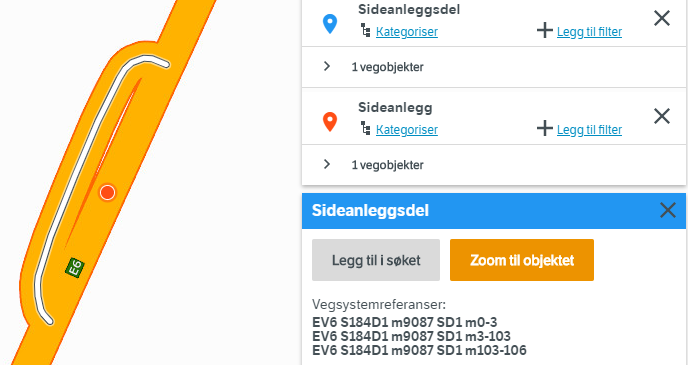
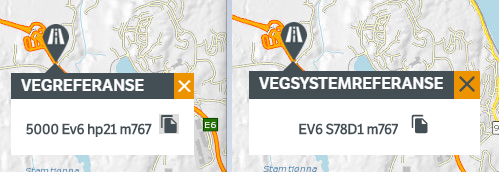

# Road reference system

The reference system will label each and every road in Norway with a road category, a road number and a metering system. Starting the year 2020, we have a major upgrade of the reference system. For technical reason, we have to run the old system in parallel with the new untill August 2020. The two systems are available through version 2 (old) and version 3 (new) of NVDB api and Vegkart. 

## Road divided into _strekning, delstrekning and meters 

Each road within each road category has a unique number. The road is split into smaller parts, first into _strekning_ (section), which again is subdivided into _delstrekning_ (subsection). Along each _delstrekning_ we count meters, starting at 0 at the beginning of the next _delstrekning_. 

The life cycle of road is divided into phases, starting with the construction fase (A, for _anlegg_ = construction), followed by operational road status (V, for existing _veg_ = road). 

Together, this constitutes the complete road reference of the form **Ev6 S78D1 m768** (Europaveg 6 Strekning (section) 78 delstrekning (subsection) 1 meter 768. 

## Complications at junctions and bifurcations 

The above model with _strekning_ and _delstrekning_ is adequate for describing the main alignment of the road, but in complex junctions and bifurcations we need to add a bit more. 

The idea is that any bifurcations from the main aligment is _*anchored*_ at a point at the main alignment centerline. This syntax is described in the previous section. We then add a new, separate labeling system and a separate metering system for the different parts of the bifurcations. In a motorway junction, the different ramps typically get a unique label and metering. 

We have two classes of bifurcations:
 
  * Those that are part of a junction
    *   _kryss_ = junction 
    * _kryssdel_ =  part of junction 
  * everything else: 
    *  _sideanlegg_ side = displaced laterally, anlegg = construction
    *  _sideanleggdel_, del = part of 

### Example Sideanlegg

Here we show the anchor point (red) at the main center line **Ev6 S184D1 m9087**. The bifurcation has its own _Sideanleggsdel_ number **SD1**, and metering system 0-106. Don't be confused by the fact that the _Sideanleggsdel_ is split into 3 segments (meter 0-3, 3-103 and 103-106). 

### Example motorway junction

Here we show the numbering of 4 different ramps _(kryssdel number Kd1-4)_ each with its own metering system. The anchor point _(ankerpunkt)_ is shown in red. 

 
# Old road reference system (before 2019-12-31) 

The old reference system is no longer in use from January 1st, 2020, but will be available through version 2 of NVDB api and vegkart untill August 2021. The components are: 

  * _Fylkesnummer_ = County number
  * _Kommunenummer_ = Municipality number. Always 00 for road category E, R and F. 
  * Road category: E, R, F, K, P or S. 
  * Road status
  * Road number
  * _hovedparsel_, Hp - Road segment number
  * meters. 
  
Along each _hovedparsel_ we count meters, starting at 0 for each new _hovedparsel_. This is not entirely unlike the new system of _delstrekning_, but the values of those two systems should not be used interchangeably. There is consideraby logic involved in the number series, se [here](https://api.vegdata.no/verdi/vegreferanse.html) for details. All this information is held in one single feature type: [532 vegreferanse](https://datakatalogen.vegdata.no/532-Vegreferanse). 

Comparing old (left) and new (right) road reference system. 

